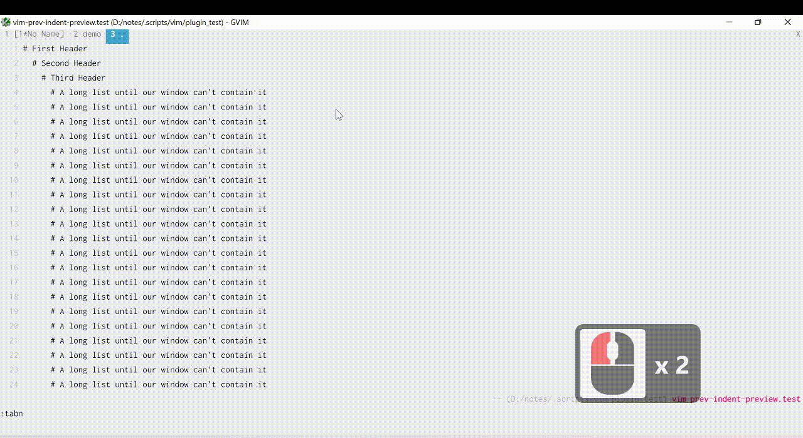

# Feature
Preview previous line (outside window) with the same (or lower) indentation.

#### Background
When we work with deep level indentation sometime we need to check whether our indentation is correct. (same with previous item), ex:
```
    -- item 1
    -- item 2
    -- item 3
      .. (deep & long nested)
    [when we are here, we want to see "-- abc", sometimes we can't see it because it is beyond our window, and scrolling is tiring]
```
So we need a preview that show previous line with same or lower indentation

#### Demo


# Installation
## Pathogen

Clone this repo to your plugin folder (usually in $HOME/.vim/bundle/)

#### Dependency
This plugin depend on [vim-go-to-non-blank-column](https://github.com/Alieff/vim-go-to-non-blank-column) (You also need to install it)


## Usage : 
1. Move cursor to first column
2. press `<alt+m>` to open
2. press `<alt+m>` again to close
